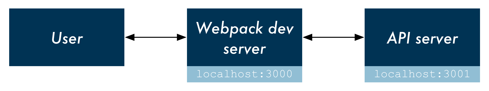

# 좋은치약 홈페이지

## Running

```
git clone git@github.com:deNsuh/chiyak_homepage.git
cd chiyak_homepage && npm install
cd client && npm install

cd ..
npm start
```

## Overview



This setup uses [node-foreman](https://github.com/strongloop/node-foreman) for process management. Executing `npm start` instructs Foreman to boot both the Webpack dev server and the API server.
